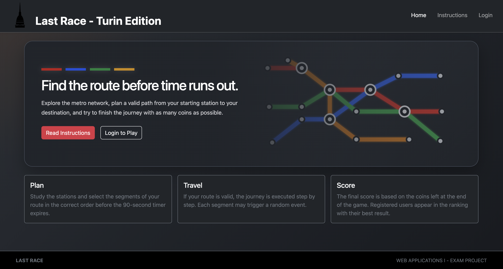
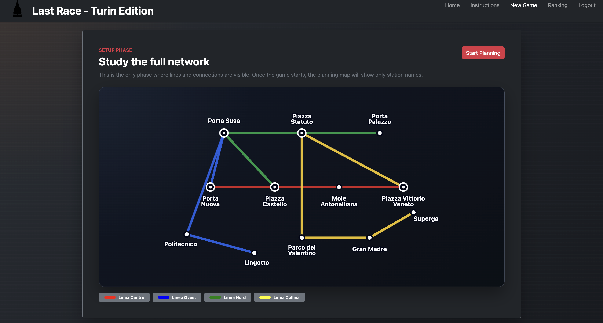
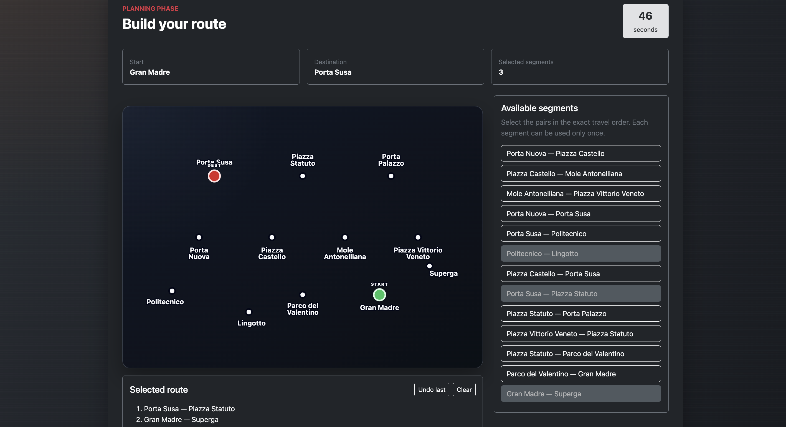
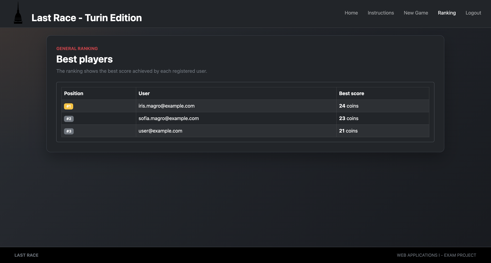

# Exam #1: "Last Race"
## Student: s353776 MAGRO SOFIA 

## React Client Application Routes

- Route `/`: home page of the application. It introduces the game and gives access to the instructions page and to the login/setup flow.

- Route `/instructions`: public instructions page. It explains the game phases, the route validation rules and the scoring system.

- Route `/login`: login page for registered users. It allows the user to authenticate with email and password.

- Route `/setup`: protected setup page. It shows the complete metro network, including stations, lines and connections. From this page the user can start a new game.

- Route `/game/:gameId/planning`: protected planning page. The `gameId` parameter identifies the game created by the server. The page shows the assigned start station, destination station, available segments, selected route and countdown timer.

- Route `/game/:gameId/execution`: protected execution page. The `gameId` parameter identifies the game being executed. If the submitted route is valid, the page shows the journey step by step, including random events and the updated number of coins.

- Route `/game/:gameId/result`: protected result page. The `gameId` parameter identifies the completed game. The page shows whether the route was valid, the final score and the journey summary.

- Route `/ranking`: protected ranking page. It shows the best score achieved by each registered user.

- Route `*`: fallback route for unknown URLs. It displays a not found page.

## API Server
#### Autenthication
- POST `/api/sessions`: authenticate user and create session.
  - request body:
    ```json
    {
      "email": "user@example.com",
      "password": "password"
    }
    ```
  - response: `200 OK` (Success), `401 Unauthorized` (Wrong credentials), `500 Internal Server Error` (Generic error).
  - response body content:
    ```json
      {
        "id": "1",
        "email": "user@example.com",
      }
      ```

- DELETE `/api/sessions/current`: Logout user and destroy the session.
  - request body: None
  - response: `200 OK` (Success), `500 Internal Server Error` (Generic error).
  - response body content: None
  
- GET `/api/sessions/current`: Get information about the currently logged-in user.
  - request body: None
  - response: `200 OK` (Success), `401 Unauthorized` (Not authenticathed), `500 Internal Server Error` (Generic error).
  - response body content:
    ```json
      {
        "id": "1",
        "email": "user@example.com",
      }
      ```

#### Game
- GET `/api/network`: Returns the full underground network used in the setup phase, including stations, lines and segments.
  -  request body: None
  -  response: `200 OK` (Success), `401 Unauthorized` (Not authenticated), `500 Internal Server Error` (Generic error).
  -  response body:
    ```json
        {
    "stations": [
      {
        "id": 1,
        "name": "Centrale",
        "isInterchange": true
      }
    ],
    "lines": [
      {
        "id": 1,
        "color": "red"
      }
    ],
    "segments": [
      {
        "id": 1,
        "station1": {
          "id": 1,
          "name": "Centrale"
        },
        "station2": {
          "id": 2,
          "name": "Porta Nord"
        },
        "line": {
          "id": 1,
          "name": "Red Line",
          "color": "red"
        }
      }
    ]
  }
  ```

- POST `/api/games`: Start a new game session for authenticated user. The server randomly assigns the starting station and the destination station, ensuring that the destination is reachable from the starting station with a minimum distance of at least 3 segments.
  - request body: None
  - response: `201 Created` (Success), `401 Unauthorized` (Not authenticated), `500 Internal Server Error` (Generic error).
  - response body content:
    ```json
    {
      "gameId": 12,
      "startStation": {
        "id": 1,
        "name": "Centrale"
      },
      "destinationStation": {
        "id": 8,
        "name": "Porto"
      },
      "startedAt": "2026-06-11T10:15:00.000Z",
      "timeLimit": 90,
      "stations": [
        {
          "id": 1,
          "name": "Centrale"
        },
        {
          "id": 2,
          "name": "Porta Nord"
        }
      ],
      "segments": [
        {
          "id": 1,
          "station1": {
            "id": 1,
            "name": "Centrale"
          },
          "station2": {
            "id": 2,
            "name": "Porta Nord"
          }
        }
      ]
    }
      ```

- POST `/api/games/:gameId/route`:Submits the route selected by the player. The server validates the route, applies random events if the route is valid, stores the selected segments and the execution result, and returns the final score.
  - request body:
    ```json
    {
      "route":[1, 4, 8, 10]
    }
    ```
  - response: `200 OK` (Success), `400 Bad Request` (Invalid Route), `401 Unauthorized` (Not authenticated),  `403 Forbidden` (Game does not belong to the authenticated user),  `404 Not Found` (Game not found), `500 Internal Server Error` (Generic error).
  - response body:
     - for a valid route:
        ```json
        {
          "gameId": 12,
          "validRoute": true,
          "finalScore": 23,
          "execution": [
            {
              "stepNumber": 1,
              "segment": {
                "id": 1,
                "station1": "Centrale",
                "station2": "Porta Nord"
              },
              "event": {
                "description": "Wrong platform",
                "cost": -2
              },
              "coinsAfterStep": 18
            }
          ]
        }
        ```
    - for an invalid route:
      ```json
      {
          "gameId": 12,
          "validRoute": false,
          "finalScore": 0,
          "execution": []
        }
      ```

- GET `/api/ranking`:Returns the general ranking of registered users, computed using the best final score obtained by each user among all their completed games.
  - request body: none
  - response:  `200 OK` (Success), `401 Unauthorized` (Not authenticathed), `500 Internal Server Error` (Generic error).
  - response body:
  ```json
      [
    {
      "userId": 1,
      "email": "user1@example.com",
      "bestScore": 25
    },
    {
      "userId": 2,
      "email": "user2@example.com",
      "bestScore": 18
    }
  ]
    ```


## Database Tables

- Table `users` - contains registered users. Fields:
   - id
   - email
   - password_hash
   - salt
- Table `stations` - contains all possible stations. Fields:
   - id
   - name
   - is_interchange: when a station is served by more than one line
- Table `lines` - contains all metro lines of the network. Fields:
  - id
  - name
  - color
- Table `events` - contains all possible events that can occur during a segment. Fields:
  - id
  - description
  - cost
- Table `segments` - contains pairs of stations connected. Fields:
    - id
    - station1
    - station2
    - line
- Table `games` - contains all recorded games played by registered users. Fields:
  - id
  - user_id
  - start_station
  - destination_station
  - started_at: game creation timestamp
  - completed_at: game completation timestamp
  - valid_route
  - final_coins
- Table `game_segments` - contains the ordered list of segments selected by the player for each game. Fields:
  - game_id
  - step_number: position of the segment in the submitted route 
  - segment_id
  - event_id
  - actual_coins

## Data Models

### Segment

```js
class Segment {
  constructor(id, station1, station2, line = null) {
    this.id = id;
    this.station1 = station1;
    this.station2 = station2;
    this.line = line;
  }
}
```

The `Segment` model represents a metro connection between two stations on a specific line.

### Game

```js
class Game {
  constructor(id, userId, startStation, destinationStation, startedAt, completedAt, validRoute, finalCoins) {
    this.id = id;
    this.userId = userId;
    this.startStation = startStation;
    this.destinationStation = destinationStation;
    this.startedAt = startedAt;
    this.completedAt = completedAt;
    this.validRoute = validRoute;
    this.finalCoins = finalCoins;
  }
}
```

The `Game` model represents a game session created by a registered user.

`Segment` and `Game` were modeled as classes because they are the main entities involved in the server-side game logic. `Segment` supports route validation, while `Game` represents the current game session, its owner, status and result.

The other database entities are mainly read and returned as plain objects, so separate models were not necessary.
## Main React Components

- `App` (in `App.jsx`): root component of the React application. It checks the current session, stores the logged-in user, manages global feedback messages and defines the application routes.

- `Layout` (in `Layout.jsx`): common layout used by the routed pages. It wraps the page content with the header, the footer and the global alert message.

- `Header` (in `Header.jsx`): navigation bar of the application. It shows the application title and the main navigation links, changing the available actions depending on whether the user is logged in.

- `HomePage` (in `HomePage.jsx`): landing page of the application. It introduces the game and gives access to the instructions page or to the login/setup flow.

- `InstructionsPage` (in `InstructionPage.jsx`): public page containing the game rules and the explanation of the setup, planning, execution and result phases.

- `LoginPage` (in `LoginPage.jsx`): login page for registered users. It collects the credentials and calls the login function passed by `App`.

- `SetupPage` (in `SetupPage.jsx`): setup phase page. It retrieves the full metro network from the server and allows the user to start a new game.

- `PlanningPage` (in `PlanningPage.jsx`): planning phase page. It manages the selected route, the countdown timer, the available segments and the route submission.

- `ExecutionPage` (in `ExecutionPage.jsx`): execution phase page. It displays the result of the route validation and, for valid routes, the ordered execution steps with their random events.

- `ResultPage` (in `ResultPage.jsx`): final result page. It summarizes the completed game, showing whether the route was valid and the final score.

- `RankingPage` (in `RankingPage.jsx`): ranking page. It retrieves and displays the best score achieved by each registered user.

- `GameNetworkMap` (in `GameNetworkMap.jsx`): SVG component used to display the metro network during the setup and planning phases.
## Screenshot

### HomePage


### Setup Page


### Planning Page


### Ranking Page


## Users Credentials

- username: sofia.magro@example.com, password: password
- username: iris.magro@example.com, password: ciao
- username: user@example.com, password: esame

## Use of AI Tools

AI tools were used as support during development to review design choices, generate example SQL seed data and prepare API test cases.

For the client side, AI tools mainly supported the graphical structure of some components, such as the metro map and CSS layout. React Bootstrap components were integrated manually for forms, buttons, cards, alerts, tables and layout elements.

The application logic, API interaction, game flow, state management and final integration were implemented, adapted and tested by me.